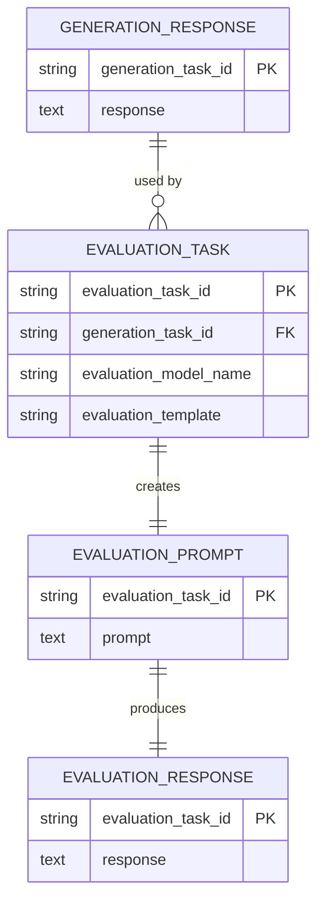

## Plan: Pass generation_response to evaluation_prompt using foreign keys (no disk reads)

### Objective
Eliminate manual file reads in `evaluation_prompt` by passing the `generation_response` object directly through the pipeline, leveraging existing foreign key columns (`generation_task_id`) in the `evaluation_tasks` table. The Dagster UI should show the correct dependency edge and data should flow in-memory within a run.

### Key Idea
Only `evaluation_prompt` needs the upstream `generation_response`. `evaluation_response` does NOT consume `generation_response`; it only depends on `evaluation_prompt` and task metadata (e.g., model).

Use multi-dimensional dynamic partitions for evaluation assets so each evaluation partition encodes both:
- `generation_task_id` (FK to upstream response)
- `evaluation_task_id`

This lets us wire `evaluation_prompt` to `generation_response` without manual IO by using a partition mapping that selects the upstream `generation_task_id` dimension. Keeping `evaluation_response` on the same multi-dimensional partitions avoids ambiguous mappings; it still won’t take `generation_response` as an input.

### Design Overview
- Keep `generation_response` partitioned by `generation_task_id` (unchanged).
- Change evaluation assets (`evaluation_prompt`, `evaluation_response`) to use a shared `MultiPartitionsDefinition` with two dynamic dimensions:
  - `generation_tasks` (keys are `generation_task_id`)
  - `evaluation_tasks` (keys are `evaluation_task_id`)
- For `evaluation_prompt`, add an input on `generation_response` with a multi→single partition mapping that selects by the `generation_tasks` dimension. This maps the downstream multi-partition’s `generation_task_id` to the upstream `generation_response(generation_task_id)`.
- `evaluation_prompt` takes `generation_response: str` directly. No manual IO reads.
- `evaluation_response` stays on the same multi-dimensional partitions for determinism but does not consume `generation_response`; it takes `evaluation_prompt` as input with an identity mapping (multi→multi).

### Implementation Steps
1) Define multi-partitions for evaluation
   - File: `daydreaming_dagster/assets/partitions.py`
   - Add `MultiPartitionsDefinition` for evaluation assets:
     - `evaluation_multi_partitions = MultiPartitionsDefinition({"generation_tasks": generation_tasks_partitions, "evaluation_tasks": evaluation_tasks_partitions})`

2) Register partition keys for both dimensions
   - File: `daydreaming_dagster/assets/core.py`
   - In `generation_tasks` asset: continue to register `generation_task_id` on `generation_tasks_partitions` (already implemented).
   - In `evaluation_tasks` asset: after building the DataFrame, register keys for the `evaluation_tasks` dimension only. Validate that each referenced `generation_task_id` exists upstream in the `generation_tasks_partitions` and fail fast if any are missing. Avoid re-registering `generation_tasks` here to keep ownership clear.

3) Wire evaluation assets to multi-partitions and FK mapping
   - File: `daydreaming_dagster/assets/llm_evaluation.py`
   - Set `partitions_def=evaluation_multi_partitions` on both `evaluation_prompt` and `evaluation_response`.
   - For `evaluation_prompt`, declare an input on `generation_response` with a partition mapping that projects the downstream multi-partition to the upstream `generation_tasks` dimension. Use Dagster’s multi→single dimension mapping utility to select by `generation_tasks`.
   - Change `evaluation_prompt` signature to accept `generation_response: str` and remove manual IO loading and the `generation_response_io_manager` resource requirement and any `deps`-only linkage.
   - `evaluation_response` consumes `evaluation_prompt` only (no `generation_response`). With identical multi-dimensional partitions, this is an identity partition mapping.

4) Build the downstream key tuple
   - When materializing evaluation partitions, the key will be a tuple `{ generation_tasks: <generation_task_id>, evaluation_tasks: <evaluation_task_id> }`.
   - Ensure the code that triggers materialization (e.g., CLI, tests) provides both dimension values. For batch runs, materialize all evaluation partitions; the mapping will automatically link the correct upstream `generation_response` for each partition via the `generation_tasks` dimension.

5) Tests
   - Update tests to materialize `evaluation_prompt` and `evaluation_response` with multi-partition keys (tuple of dim→key).
   - Assert that `evaluation_prompt` receives the correct `generation_response` value in-memory; IO manager logs should not show a manual `load_input` call.
   - Assert that `evaluation_response` depends only on `evaluation_prompt` and runs correctly for each multi-partition key.
   - Keep tests that verify correctness of FK columns in `evaluation_tasks`.

6) Configurations
   - No change required to IO managers for production; file-based persistence remains for `generation_response`, but in-run data passing will occur via Dagster inputs.
   - For dev/tests, you can configure an in-memory IO manager for faster runs, but it is optional.

### Rollout
1) Implement behind a small feature flag (optional) to switch evaluation assets to multi-partitions.
2) Run `uv run pytest -q` to validate.
3) In Dagster, materialize `generation_tasks`, `evaluation_tasks`, then `evaluation_prompt`/`evaluation_response` with multi-partition keys.
4) Remove the manual IO loading code and the temporary flag after validation.

### Backout
- Revert evaluation assets to single-dimension partitions and restore manual IO loading if needed. No data migration required.

### Notes
- Only `evaluation_prompt` requires `generation_response`; `evaluation_response` does not.
- Using shared multi-dimensional partitions on both evaluation assets ensures deterministic, purely key-based partition mappings without reading tables at mapping time.
- This approach uses the already-present FK (`generation_task_id`) and avoids any string splitting of IDs.
- If short IDs are introduced for tasks later, the FK relationship remains intact; the mapping continues to work without changes.

### Entity relationships and partition lineage

- Entity relationships
  - One `generation_response` (identified by `generation_task_id`) is used by many `evaluation_task` rows that reference that `generation_task_id` (one-to-many).
  - Each `evaluation_task` produces exactly one `evaluation_prompt` (one-to-one).
  - Each `evaluation_prompt` produces exactly one `evaluation_response` (one-to-one).

- Partitioning
  - `generation_response`: single-dimension partitioned by `generation_task_id`.
  - `evaluation_prompt` and `evaluation_response`: multi-dimensional partitions with dimensions `{ generation_tasks: generation_task_id, evaluation_tasks: evaluation_task_id }`.

- Partition mappings
  - `generation_response(gen_task)` → `evaluation_prompt({gen_task, eval_task})`: project the downstream key to the `generation_tasks` dimension and select the single matching upstream partition.
  - `evaluation_prompt({gen_task, eval_task})` → `evaluation_response({gen_task, eval_task})`: identity mapping (same key on both dimensions).

Note: The multi-dimensional partition space is the cross-product of the two dimensions; we only materialize valid `(generation_task_id, evaluation_task_id)` pairs that exist in the `evaluation_tasks` table.

### Pros, cons, and mitigations

- **Pros**
  - **No manual disk reads for evaluation_prompt**: The `generation_response` is passed in-memory via Dagster inputs within a run, improving speed and removing brittle file lookups.
  - **Correct lineage by FK**: The dependency is keyed by `generation_task_id`, ensuring `evaluation_prompt` always uses the correct upstream response.
  - **Deterministic partition mappings**: Shared multi-dimensional partitions for evaluation assets make the prompt→response mapping an identity, simplifying orchestration.
  - **Clear 1→many and 1→1 relationships**: Encodes one `generation_response` to many `evaluation_tasks`, while keeping `evaluation_task`→`evaluation_prompt`→`evaluation_response` as one-to-one.
  - **Better UI visibility**: Dagster shows explicit edges and partition dimensions, aiding debugging and backfills.

- **Cons**
  - **Higher partitioning complexity**: Multi-dimensional partitions require constructing and passing key tuples and thinking about the cross-product surface.
  - **Risk of invalid combinations**: The partition space is a cross-product; without guards, it could allow keys that don’t correspond to real evaluation tasks.
  - **Additional wiring**: Requires setting up a multi→single partition mapping and updating tests/invocations to provide both dimension values.
  - **Dynamic partition management**: Must manage dynamic keys for both dimensions and validate FK existence; backfills need careful key selection.
  - **Run-scoped in-memory benefit**: In-memory passing only applies within a run; cross-run reads still rely on persisted files (which we retain).

- **Mitigations**
  - **Key generation from source-of-truth**: Drive materializations using keys derived directly from the `evaluation_tasks` table to avoid invalid cross-product pairs.
  - **FK validation**: In `evaluation_tasks`, validate that each referenced `generation_task_id` exists upstream; fail fast with helpful metadata.
  - **Helper APIs**: Provide a utility to produce valid multi-partition keys `(generation_task_id, evaluation_task_id)` for scheduling/backfills/tests.
  - **Selective materialization**: When backfilling, select only valid key pairs (e.g., via CLI or programmatic run requests) rather than scanning the full cross-product.
  - **Observability**: Log selected keys and upstream mappings; add assertions in tests that `evaluation_prompt` receives the expected `generation_response` without IO.

